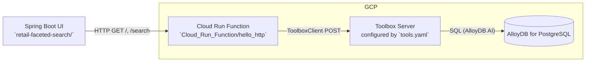

# Faceted Retail Search with AlloyDB AI

Faceted product search demo that combines:

- A Spring Boot UI for browsing products with facet filters and contextual search.
- A Python Cloud Run Function that proxies requests to a Toolbox server.
- An AlloyDB for PostgreSQL database leveraging AlloyDB AI (text/image embeddings, ScaNN, semantic reranking, and model prompts) for vector search and filtering.

This repository provides a working reference implementation you can run locally or deploy on Google Cloud.

## Table of Contents

- **[Architecture](#architecture)**
- **[Prerequisites](#prerequisites)**
- **[Quick Start](#quick-start)**
- **[AlloyDB Setup](#alloydb-setup)**
- **[Toolbox Server Setup](#toolbox-server-setup)**
- **[Cloud Run Function (Python)](#cloud-run-function-python)**
- **[Retail UI App (Spring Boot)](#retail-ui-app-spring-boot)**
- **[Local Development](#local-development)**
- **[Containerization and Deployment](#containerization-and-deployment)**
- **[Configuration Matrix](#configuration-matrix)**
- **[API Contracts and Examples](#api-contracts-and-examples)**
- **[Troubleshooting](#troubleshooting)**
- **[Data Source and License](#data-source-and-license)**

## Architecture



- **UI**: `retail-faceted-search/` renders the catalog and filters using Thymeleaf.
- **Cloud Run Function**: `Cloud_Run_Function/main.py` exposes `hello_http` and calls Toolbox based on request payload.
- **Toolbox Server**: Uses `tools.yaml` to define SQL tools that execute on AlloyDB (vector search, facet fetch, reranking, etc.).
- **AlloyDB**: Schema and indexes in `db_script.sql`. Embeddings and ScaNN indexes power efficient search.

## Prerequisites

- Java 11 and Maven for the UI app.
- Python 3.10+ and `pip` for the Cloud Run Function (local dev).
- Docker (optional but recommended for container builds).
- Google Cloud project with:
  - AlloyDB for PostgreSQL cluster and instance
  - Cloud Run and Cloud Build enabled
  - Vertex AI enabled (AlloyDB AI integrates with Vertex AI models)
- gcloud CLI authenticated and configured.

## Quick Start

1. Set up AlloyDB and load sample data. See [AlloyDB Setup](#alloydb-setup).
2. Deploy or run a Toolbox server with `tools.yaml`. See [Toolbox Server Setup](#toolbox-server-setup).
3. Deploy the Cloud Run Function and point it to the Toolbox server. See [Cloud Run Function](#cloud-run-function-python).
4. Run the Spring Boot UI locally and point it to the Cloud Run Function URL. See [Retail UI App](#retail-ui-app-spring-boot).

Once running, open the UI at http://localhost:8080 and use filters/search to browse.

## AlloyDB Setup

1. Create an AlloyDB cluster/instance and database. Ensure AlloyDB AI preview features are available in your environment.
2. Connect to the database (psql or Cloud Console) and run `db_script.sql`:

   - File: `db_script.sql`
   - Creates table `apparels` with text and image embedding columns:
     - `embedding vector(768)` for text
     - `img_embeddings vector(1408)` for images
   - Instructions reference a Google Sheet with INSERT statements:
     - Copy 10–50 sample inserts for a demo.
   - Populates embeddings:
     - `embedding('text-embedding-005', pdt_desc)`
     - `ai.image_embedding('multimodalembedding@001', image => gsutil_uri, mimetype => 'image/jpg')`
   - Enables ScaNN and creates indexes:
     - `CREATE EXTENSION IF NOT EXISTS alloydb_scann;`
     - `CREATE INDEX ... USING scann (embedding cosine)`
     - `CREATE INDEX ... USING scann (img_embeddings cosine)`

3. Confirm the following succeed in your session (may require instance config change/restart):

   - `SET scann.enable_inline_filtering = on;`
   - `SET scann.enable_preview_features = on;`

4. Optional but recommended indexes on filter columns are included in `db_script.sql`.

## Toolbox Server Setup

The Toolbox server exposes SQL tools defined in `tools.yaml` to clients like the Cloud Run Function.

- File: `tools.yaml`
- Update the following placeholders before starting the server:
  - `sources.alloydb.project` → your GCP project ID
  - `region`, `cluster`, `instance`
  - `database`, `user`, `password`

Key tools used by the app:

- `get-retail-facet-filters`: returns distinct `apparels` attributes used for filters
- `filtered-vector-search-quality`: vector search + LLM reranking + filter gate
- Additional examples include text/image search and reranking pipelines

Start or deploy the Toolbox server with `tools.yaml` and note its base URL (e.g., `https://your-toolbox-xxxx.a.run.app`). You will use this URL in the Cloud Run Function config below.

## Cloud Run Function (Python)

Directory: `Cloud_Run_Function/`

- Entry point: `hello_http` in `main.py`
- Dependencies: `requirements.txt` (uses `functions-framework` and `toolbox-langchain`)
- Behavior:
  - If request JSON has `{ "name": "FILTERS" }` → calls Toolbox tool `get-retail-facet-filters`
  - Else expects `{ "name": "<JSON stringified Product filters>" }` and invokes `filtered-vector-search-quality`

Important code locations:

- `main.py` placeholders to replace:
  - `ToolboxClient("<<YOUR_TOOLBOX_SERVER>>")` in `toolboxcall()`
  - `ToolboxClient("YOUR_TOOLBOX_SERVER")` in `toolboxcallformatches()`

### Run locally

```bash
cd Cloud_Run_Function
python -m venv .venv && source .venv/bin/activate
pip install -r requirements.txt

# Start function locally on :8081
functions-framework --target hello_http --port 8081
```

Test locally:

```bash
# Fetch filters
curl -s -X POST http://localhost:8081 \
  -H 'Content-Type: application/json' \
  -d '{"name":"FILTERS"}' | jq .

# Vector search with filters
curl -s -X POST http://localhost:8081 \
  -H 'Content-Type: application/json' \
  -d '{"name":"{\\"categories\\":[\\"Men\\"],\\"subCategories\\":[],\\"colors\\":[],\\"genders\\":[],\\"searchtext\\":\\"running shoes\\"}"}' | jq .
```

### Deploy to Cloud Run

Deploy as a Cloud Run service using Cloud Buildpacks:

```bash
gcloud run deploy retail-toolbox-proxy \
  --source . \
  --region us-central1 \
  --allow-unauthenticated
```

After deploy, note the service URL, e.g. `https://retail-toolbox-proxy-xxxx-uc.a.run.app`. Use it in the UI configuration below.

## Retail UI App (Spring Boot)

Directory: `retail-faceted-search/`

- Entry: `cloudcode.helloworld.RetailApplication` (uses `PORT`, defaults to `8080`).
- Controller: `cloudcode.helloworld.web.RetailController`
  - `GET /` renders filters and initial products
  - `GET /search` applies selected filters and/or search text
- Repository: `cloudcode.helloworld.web.ProductRepository`
  - Constant `TOOLBOX_ENDPOINT` must point to the deployed Cloud Run Function URL
  - Posts JSON to that endpoint and expects a JSON array of product maps
- View: `src/main/resources/templates/index.html` (Thymeleaf)

Update the Toolbox endpoint:

- File: `retail-faceted-search/src/main/java/cloudcode/helloworld/web/ProductRepository.java`
  - Replace the placeholder value of `TOOLBOX_ENDPOINT` (e.g., `https://retail-product-search-quality-<<YOUR_PROJECT_NUMBER>>.us-central1.run.app`) with your Cloud Run Function URL.

### Run locally (Maven)

```bash
cd retail-faceted-search
mvn spring-boot:run
# UI on http://localhost:8080
```

### Build runnable JAR

```bash
mvn clean package -DskipTests
java -jar target/hello-world-1.0.0.jar
```

### Run in Docker locally

```bash
docker build -t retail-faceted-search:local ./retail-faceted-search
docker run --rm -p 8080:8080 -e PORT=8080 retail-faceted-search:local
# UI on http://localhost:8080
```

## Containerization and Deployment

### UI App container (provided)

- Dockerfile: `retail-faceted-search/Dockerfile` (multi-stage Maven → OpenJDK 11).

Build and deploy to Cloud Run:

```bash
PROJECT_ID=$(gcloud config get-value project)
IMAGE=gcr.io/$PROJECT_ID/retail-faceted-search:latest

docker build -t $IMAGE ./retail-faceted-search
docker push $IMAGE

gcloud run deploy retail-faceted-search \
  --image $IMAGE \
  --region us-central1 \
  --allow-unauthenticated \
  --set-env-vars PORT=8080
```

### Cloud Run Function (build from source)

See deployment snippet above under the function section.

## Configuration Matrix

- **TOOLBOX_ENDPOINT**
  - Location: `ProductRepository.java`
  - Value: Cloud Run Function URL (e.g., `https://retail-toolbox-proxy-xxxx-uc.a.run.app`)

- **Toolbox Server URL in Function**
  - Location: `Cloud_Run_Function/main.py`
  - Values to replace: `<<YOUR_TOOLBOX_SERVER>>` and `YOUR_TOOLBOX_SERVER`
  - Value: Toolbox server base URL that serves `tools.yaml`

- **AlloyDB connection in tools.yaml**
  - Location: `tools.yaml` under `sources.alloydb`
  - Required: `project`, `region`, `cluster`, `instance`, `database`, `user`, `password`

- **PORT**
  - UI respects `PORT` env var (defaults to 8080)

## API Contracts and Examples

### Cloud Run Function: `hello_http`

- URL: your deployed function URL
- Method: `POST`
- Content-Type: `application/json`

1) Fetch facet filters

Request:

```json
{ "name": "FILTERS" }
```

Response (example shape):

```json
[
  {"id":"...","category":"Men","sub_category":"Shoes","color":"Black","gender":"Men","content":"...","uri":"https://..."}
]
```

2) Vector search with filters

Request:

```json
{
  "name": "{\"categories\":[\"Men\"],\"subCategories\":[],\"colors\":[],\"genders\":[],\"searchtext\":\"running shoes\"}"
}
```

Response: same shape as above (array of product maps).

### UI Endpoints

- `GET /` – loads filters and initial product grid
- `GET /search` – query params:
  - `categories` (repeatable)
  - `subCategories` (repeatable)
  - `colors` (repeatable)
  - `genders` (repeatable)
  - `searchtext` (string)

## Troubleshooting

- **Empty results in UI**
  - Verify `TOOLBOX_ENDPOINT` in `ProductRepository.java` points to your function URL.
  - Call the function directly with `curl` to confirm responses.
  - Ensure data is loaded into `apparels` and embeddings/indexes are created.

- **Function errors calling Toolbox**
  - Update Toolbox URL in `main.py` to your server.
  - Confirm Toolbox server is reachable and `tools.yaml` credentials are correct.

- **AlloyDB AI errors**
  - Ensure AlloyDB version supports AI features and ScaNN extension is enabled.
  - Check that `SET scann.enable_preview_features = on;` is applied if required by your environment.

- **CORS / Authentication**
  - The demo assumes unauthenticated access for simplicity. For production, add IAM auth on Cloud Run and secure the UI → Function → Toolbox hops.

## Data Source and License

- Sample data from Kaggle: https://www.kaggle.com/datasets/vikashrajluhaniwal/fashion-images/
- License reference: `LICENSE`

---

Maintained as a demo for faceted retail search using AlloyDB AI, Spring Boot, and Cloud Run.

